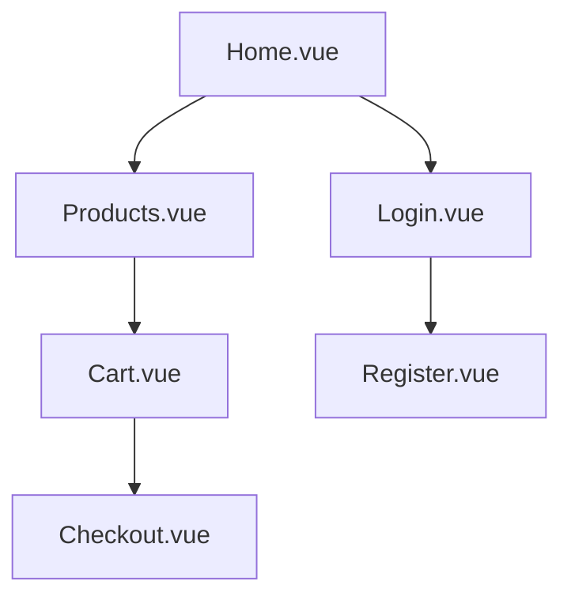
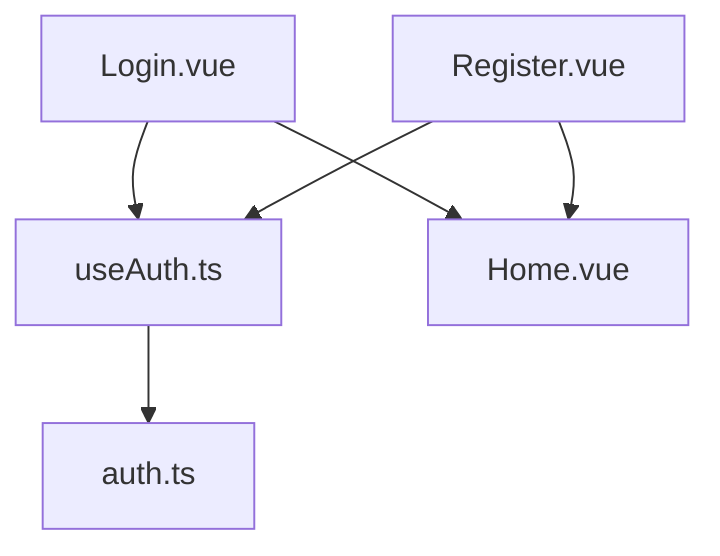

## 🛒 VITE-Carrito

Aplicación web moderna para gestionar productos, visualizar detalles y operar un carrito de compras de forma rápida, responsiva y segura. Construida con **Vue 3**, **Vite**, **TypeScript** y arquitectura modular defensiva.

---

### 📦 Estructura del proyecto

```bash
src/
├── assets/         # Imágenes, íconos, fuentes
├── components/     # Reutilizables (ProductCard, CartItem, QuantitySelector)
├── composables/    # Lógica reactiva (useCart, useProduct, useAuth)
├── layouts/        # Layouts base (MainLayout, AuthLayout)
├── pages/          # Vistas principales (Home, Products, Cart, Checkout, Login, Register)
├── plugins/        # Configuración global (i18n, pinia)
├── router/         # Rutas con lazy loading
├── store/          # Estado global con Pinia (cart, auth)
├── types/          # Interfaces y tipos (Product, CartItem, User)
├── scripts/        # Scripts defensivos (clean.ps1)
├── App.vue         # Componente raíz
└── main.ts         # Punto de entrada
```

---

### 🧠 Tecnologías

- ⚡ Vite
- 🍃 Vue 3 + Composition API
- 🛡️ TypeScript
- 🗂️ Pinia
- 🌐 Vue Router
- 🎨 Tailwind CSS (opcional)
- 🧪 Vitest (testing opcional)

---

### 🧪 Scripts útiles

```bash
# Instalar dependencias
npm install

# Iniciar servidor de desarrollo
npm run dev

# Build para producción
npm run build

# Limpiar entorno y liberar puertos (Windows)
powershell ./scripts/clean.ps1
```

---

### 🧭 Diagrama de navegación



---

### 🔐 Diagrama de flujo de autenticación



---

### 🛡️ Composable defensivo: `useCart.ts`

```ts
export function useCart() {
  const cart = ref<CartItem[]>([])
  const addItem = (item: Product) => {
    if (!item || !item.id || item.price <= 0) return
    const existing = cart.value.find(p => p.id === item.id)
    if (existing) {
      existing.quantity += 1
    } else {
      cart.value.push({ ...item, quantity: 1 })
    }
  }
  const removeItem = (id: string) => {
    cart.value = cart.value.filter(p => p.id !== id)
  }
  return { cart, addItem, removeItem }
}
```

---

### 🧩 Alias recomendados (`vite.config.ts`)

```ts
import { defineConfig } from 'vite'
import path from 'path'

export default defineConfig({
  resolve: {
    alias: {
      '@': path.resolve(__dirname, './src'),
      '@assets': path.resolve(__dirname, './src/assets'),
      '@components': path.resolve(__dirname, './src/components'),
      '@composables': path.resolve(__dirname, './src/composables'),
      '@pages': path.resolve(__dirname, './src/pages'),
      '@store': path.resolve(__dirname, './src/store'),
      '@types': path.resolve(__dirname, './src/types'),
    },
  },
})
```

---

### 🌍 Onboarding multicultural

- Comentarios bilingües (`es` / `en`) en componentes
- Props descriptivos y consistentes
- Validación visual y accesible (`required`, `email`, `minLength`)
- Diagramas Mermaid para navegación y lógica
- Mensajes de error claros y accesibles
- Responsive design con Tailwind CSS

---


