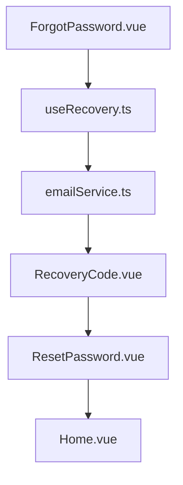
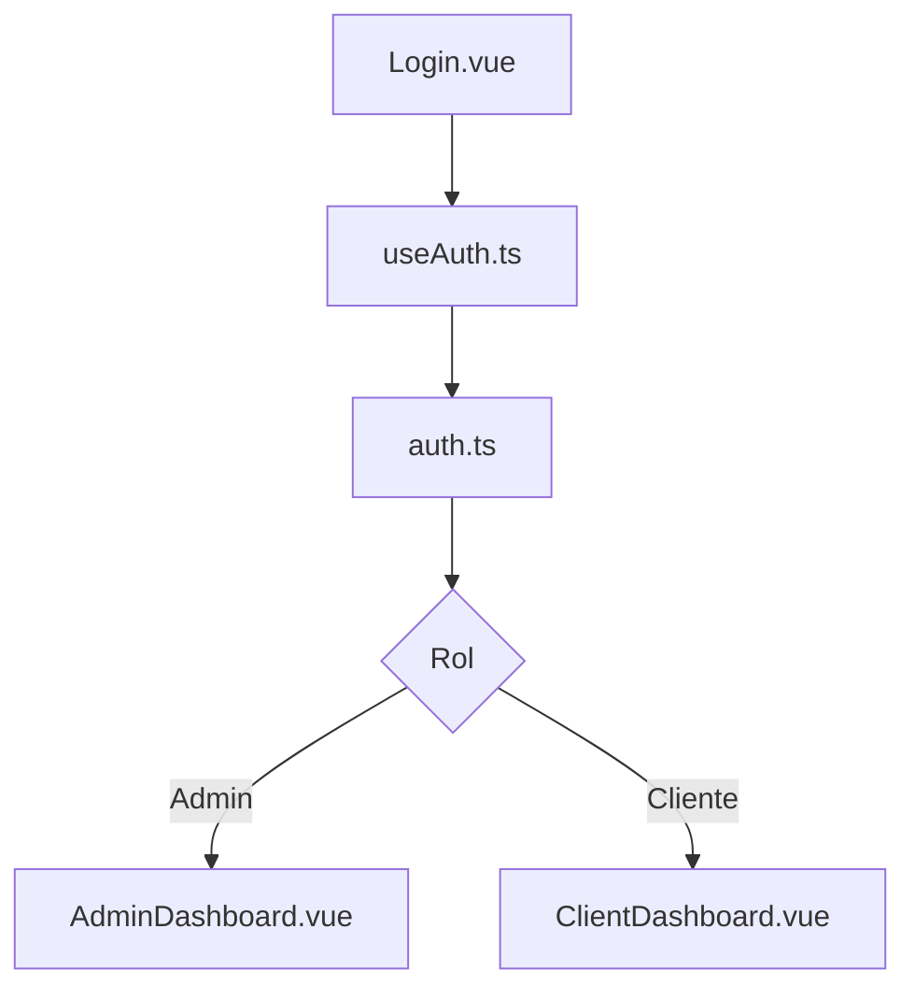

¡Vamos a ello! Aquí tienes un ejemplo de `README.md` visual, defensivo y multicultural para documentar el **módulo de roles y recuperación de contraseña** en tu proyecto **VITE-Carrito**. Está diseñado para facilitar el onboarding técnico, la navegación segura y la colaboración entre equipos diversos.

---

## 🔐 Módulo de Autenticación y Roles

Este módulo gestiona el acceso de usuarios, diferenciación de roles (admin/cliente) y recuperación segura de contraseñas. Está diseñado con lógica defensiva, validación visual y flujos claros para equipos multiculturales.

---

### 🧠 Estructura del módulo

```bash
src/
├── pages/
│   ├── Login.vue
│   ├── Register.vue
│   ├── ForgotPassword.vue
│   ├── RecoveryCode.vue
│   ├── ResetPassword.vue
│   ├── AdminDashboard.vue
│   └── ClientDashboard.vue
├── composables/
│   ├── useAuth.ts
│   └── useRecovery.ts
├── store/
│   └── auth.ts
├── services/
│   └── emailService.ts
```

---

### 🧭 Diagrama de flujo de recuperación de contraseña



---

### 🧭 Diagrama de flujo de roles



---

### 🛡️ Validaciones defensivas

```ts
// useFormValidation.ts
export function useFormValidation() {
  const isEmailValid = (email: string) =>
    /^[^\s@]+@[^\s@]+\.[^\s@]+$/.test(email)

  const isPasswordStrong = (pass: string) =>
    pass.length >= 8 && /[A-Z]/.test(pass) && /\d/.test(pass)

  return { isEmailValid, isPasswordStrong }
}
```

---

### 🌍 Recomendaciones multiculturales

- Comentarios bilingües (`es` / `en`) en formularios y validaciones
- Mensajes de error accesibles y descriptivos
- Diagramas Mermaid para explicar flujos a nuevos desarrolladores
- Navegación condicional basada en roles con `router.beforeEach`
- Inclusión de íconos y colores accesibles para feedback visual

---

### 🧪 Scripts útiles

```bash
# Ejecutar pruebas de autenticación
npm run test:auth

# Limpiar entorno y reiniciar flujo de recuperación
powershell ./scripts/reset-auth.ps1
```

---

¿Quieres que generemos también un README visual para el módulo de productos o el flujo de pedidos? O si prefieres, puedo ayudarte a crear un `README` por dominio (auth, cart, products, admin) con enlaces cruzados y navegación visual. ¿Cuál sería el siguiente módulo que quieres documentar?


Aquí tienes el diagrama visual del flujo de roles (admin/cliente) listo para integrarlo en tu `README.md` defensivo y multicultural:


Este diagrama muestra cómo `Login.vue` conecta con `useAuth.ts` y `auth.ts`, y cómo el flujo se bifurca según el rol del usuario hacia `AdminDashboard.vue` o `ClientDashboard.vue`. Es perfecto para explicar la navegación condicional y reforzar la lógica de permisos en tu app.

¿Te gustaría que preparemos ahora una imagen comparativa entre dashboards o un diagrama visual para el módulo de productos y carrito? También puedo ayudarte a agrupar todos estos assets en una carpeta `docs/diagrams` con nombres defensivos y listos para onboarding. ¿Qué visual te gustaría generar a continuación?
